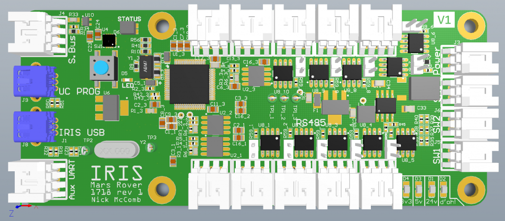

# IRIS Node

Designed by [Nick McComb](www.nickmccomb.net) for OSURC Mars Rover.

## Summary

Made for MR1718 as part of the OSU Robotics Club.

Enables a single USB port to act as 10 RS485 Transceivers, receive inputs from an S.BUS style RC receiver, and interface with a few switches. Input power is 24V (self powered, no power is drawn from the USB connection). Features a Teensy 3.2 microcontroller.

This design is entirely Open Source and is available on CircuitMaker, see below for a link to the file.

This is a 4-layer design.

The name "Iris" comes from the greek messenger god, [Iris](http://www.theoi.com/Pontios/Iris.html). This is the board that acts as a "messenger god" for our computer, telling the rest of the robot what to do. 

### Bill of Materials

[Bill of Materials V2](https://docs.google.com/spreadsheets/d/1Z_BUTqAl6qHLze04HCUyY8IqsqWJTmvCWzt6RRplw2Y/edit?usp=sharing)

[Bill of Materials V1](
https://docs.google.com/spreadsheets/d/1TkVeK_GaS78QLqv8NcE_QGGE-NSj-3agn10lKnISSjQ/edit?usp=sharing
)

#### Design files

[MR1718 IRIS on CircuitMaker](https://workspace.circuitmaker.com/Projects/Details/Nick-McComb/OSURC-Mars-Rover-2017-2018-Iris-Board)

### Downloads

[Schematic V2](files/iris-v2-schematic.pdf)

[Schematic V1](files/iris-v1-schematic.pdf)

[3D Model V1 (STEP)](files/iris.step)

### Known Issues

#### Version 1
- Used CAN tx/rx instead of hardware UART
- Connections from FTDI to RS485 transceiver wrong, need to short DE / RE pins together, then this connection goes to FTDI enable. PWREN for the RS485 converted is wrong naming and doesn’t reflect its purpose. No connection to PWREN on 4232 needed...
- Missing 3v3 rail connection to VBAT pin on Teensy. Will program without it, but will not boot without it.
- For R46 vs R47 selection, only R47 is needed.
- No invert needed for S.BUS connection (bridge pins)
- No serial number spot on silkscreen
- No MODBUS ID number spot on silkscreen
- Likely that this should use a high-speed USB hub instead of the current full-speed implementation. It is easy, without deliberate planning, to hit the bottleneck of the USB hub.
- Remove GND connection for RS485 going out of the board (to ensure reverse protection downstream)

#### Version 2
- U8_7 pin 1 silkscreen dot not visible 
- R1 silkscreen not visible
- There is an as-yet undiagnosed issue where IRIS would entirely cut out after a varying amount of time (anything from 15 minutes to hours). We do not know what causes this issue, but the software has been written to recover from the issue. We suspect it might be heat dependent, because it happened more often when the lab was hotter.
