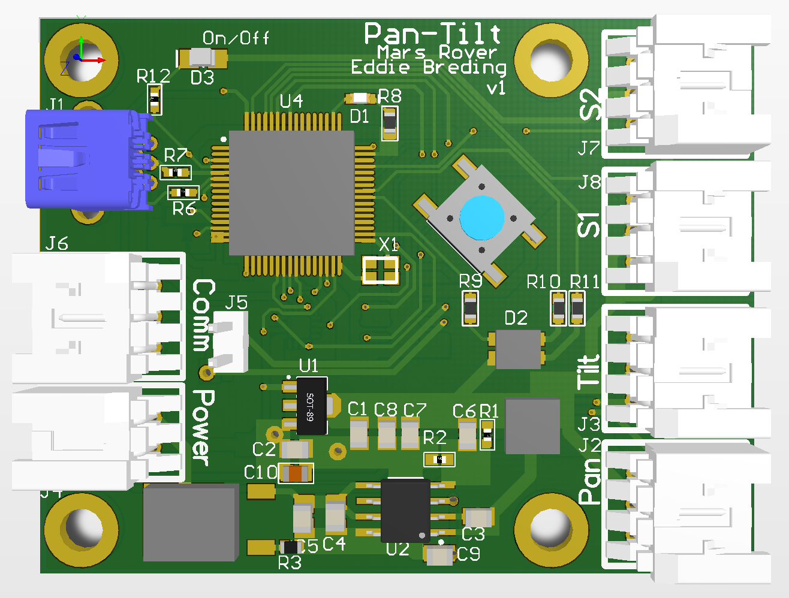

# Pan-Tilt Node

<!--  -->

Designed by Eddie Breding and Nick McComb for OSURC Mars Rover.

## Summary

Made for MR1718 as part of the OSU Robotics Club.

This board controls servos that allow Rover operators to pan and tilt multiple cameras.

### Bill of Materials

[Bill of Materials V1](
https://docs.google.com/spreadsheets/d/1sePOm_ULSmw4YCTWNVr9zKYQwp8flvRjdFlzOkxwHOo/edit?usp=sharing
)

#### Design files

[MR1718 Pan-Tilt on CircuitMaker](https://workspace.circuitmaker.com/Projects/Details/Edward-Breding/MR1718-Pan-Tilt)

### Downloads

[Schematic V1](files/pan-tilt-v1-schematic.pdf)

<!-- [3D Model V1 (STEP)](files/tower.step) -->

### Known Issues

#### Version 1

- Missing 3v3 rail connection to VBAT on Teensy. Will program without it, but will not boot without it.
