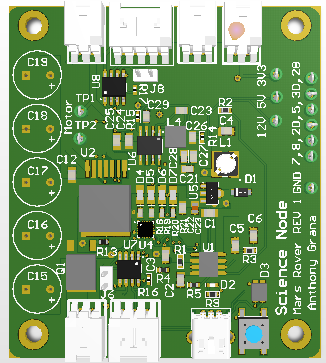

Science Node
============

Designed by Anthony Grana.

Summary
-------

Made for the science end affector for the 2018 rover. Powers, and
comunicates with the [Soil
Probe](https://www.fondriest.com/pdf/stevens_hydra_manual.pdf) via
RS-485. Uses simple logic to power a drill motor (24V,5A, full forward,
full back, stop). Outputs 5V to power a [digital
camera.](https://www.amazon.com/Canon-PowerShot-Stabilized-2-7-Inch-Black/dp/B0035FZJJ4)
Sends a signal to the didgital camera to control shoot and zoom.

### Bill of Materials

[Bill of
Materials V1.1](https://docs.google.com/spreadsheets/d/1dY48bTzPCWO-qP4mQwElCYWBNv3Bg6SGOoxIt3NPqik/edit?usp=sharing)

#### Design Files

[Science node on circuit
maker](https://workspace.circuitmaker.com/Projects/Details/Anthony-Grana/Sience-Node)

[V1.1](files/SienceNode.Zip)

### Known Issues
V1.1

1. The Drill motor controller will pull 5A but the curent power connector for the board can only handle 3A.
2. For both RS 485 chips, the RX and TX pins need to be reversed.
3. The RS 485 for the soil sensor is connected to the CAN RX TX instead of the Serial RX TX.

V1.2

No Known Issues
