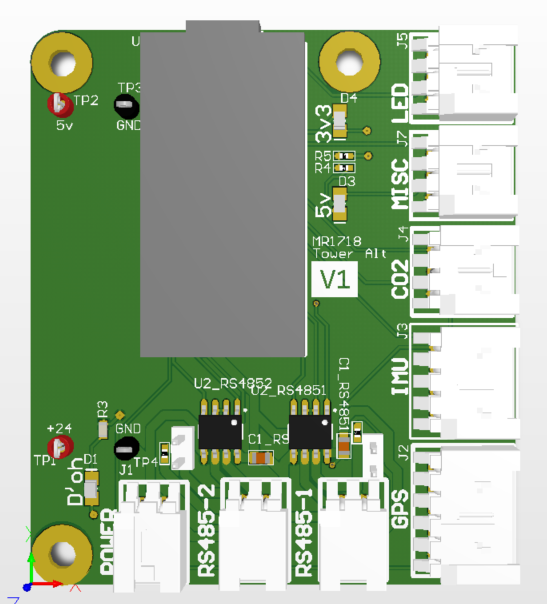

# Tower Alt

Designed by [Nick McComb](www.nickmccomb.net) for OSURC Mars Rover.

## Summary

Made for MR1718 as part of the OSU Robotics Club.

This board acts as an alternate for Rover's [Tower Node](tower.md) when both of the boards we had didn't work. It really just breaks out a Teensy 3.2 to a few different connectors.

### Bill of Materials

[Bill of Materials V1](https://docs.google.com/spreadsheets/d/19i468ReDNzdnqVHqhV62DnraayI0Lsa_KynYnzvA6o8/edit?usp=sharing)

#### Design files

[Tower Alt on CircuitMaker](https://workspace.circuitmaker.com/Projects/Details/Nick-McComb/MR1718-Tower-Alt)

### Downloads

[Schematic V1](files/tower-alt-v1-schematic.pdf)

[3D Model V1 (STEP)](files/tower-alt.step)

### Known Issues

#### Version 1
