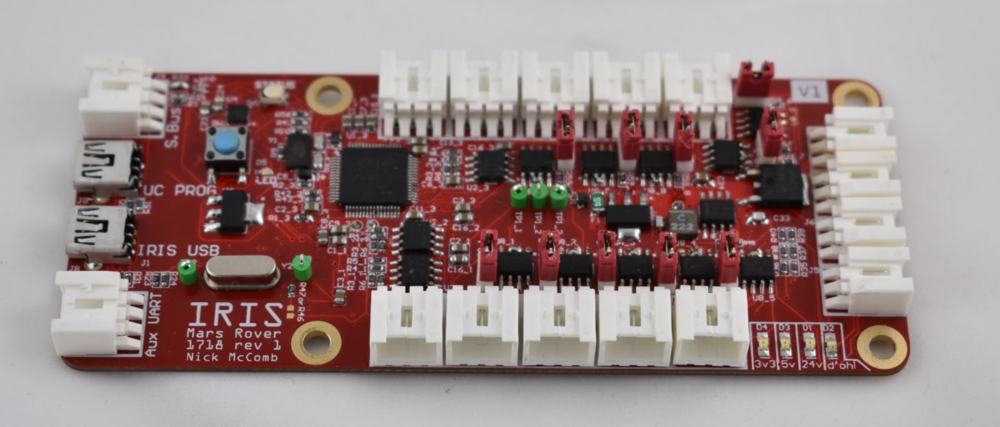
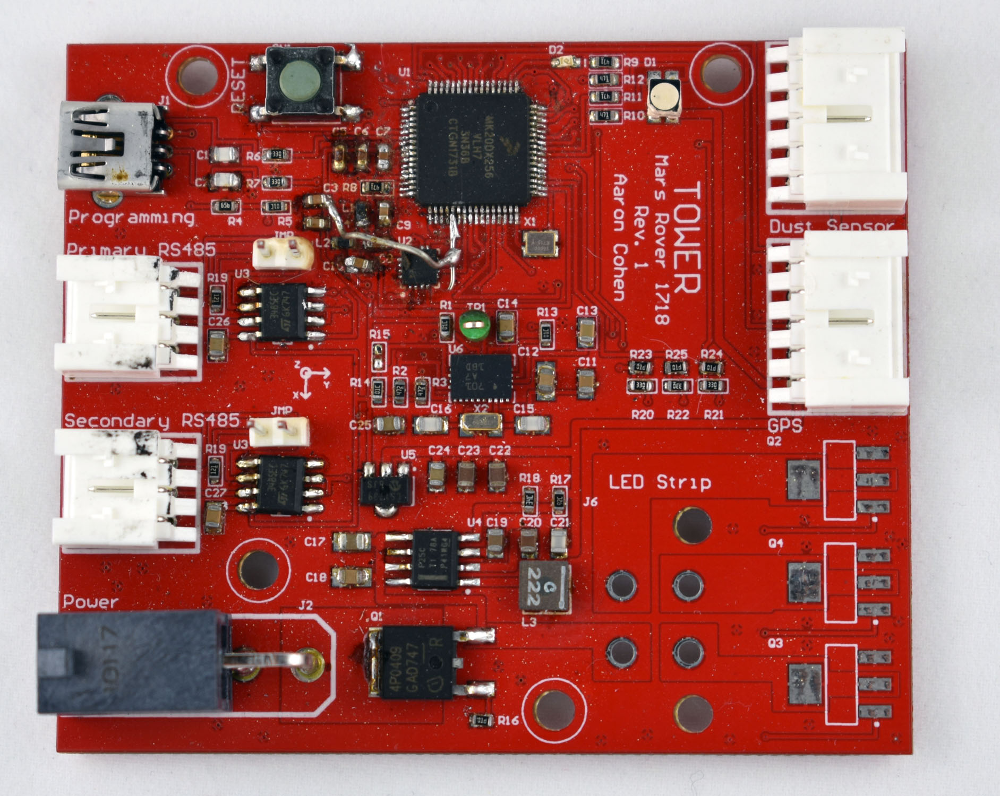

# Tower Node

<!--  -->

Designed by Aaron Cohen and Nick McComb for OSURC Mars Rover.

## Summary

Made for MR1718 as part of the OSU Robotics Club.

This acts as one of the primary external sensor interfaces for the Rover.

### Bill of Materials

[Bill of Materials V1](
https://docs.google.com/spreadsheets/d/1oX7HrmjTKpYs4jfeYDzYt9uXc7Juk1raBXVIk1hgw0U/edit?usp=sharing
)

#### Design files

[MR1718 Tower Node on CircuitMaker](https://workspace.circuitmaker.com/Projects/Details/Nick-McComb/MR-1718-Tower-Node)

### Downloads

[Schematic V1](files/tower-v1-schematic.pdf)

[3D Model V1 (STEP)](files/tower.step)

### Known Issues

#### Version 1

- Missing 3v3 rail connection to VBAT on Teensy. Will program without it, but will not boot without it.
